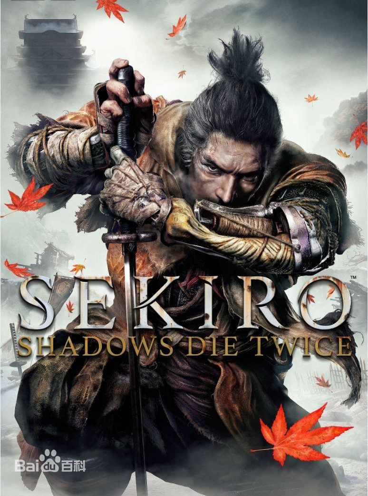

# [《只狼：影逝二度》](https://sekiro.cubejoy.com/index.html)

《只狼：影逝二度》（Sekiro：Shadows Die Twice）是一款由[From Software](https://baike.baidu.com/item/From%20Software/61801549?fr=aladdin)制作的第三人称视角的动作冒险[RPG](https://baike.baidu.com/item/%E8%A7%92%E8%89%B2%E6%89%AE%E6%BC%94%E6%B8%B8%E6%88%8F/1730573?fromtitle=rpg&fromid=24462&fr=aladdin)类游戏，玩家将操控一位忍者，拯救他的主人——拥有日本贵族血统的大能的御子，并向他的天敌复仇。该游戏已于2019年3月22日全球同步上市，并支持中文版。 [1] 

游戏剧情将探索生死冲突不断的16世纪后期，残酷的日本战国时代。在黑暗、扭曲的世界，玩家与威胁生命的敌人对峙，活用义手装备各种致命武器，大显忍者身手，在血腥对抗中潜行、上下穿梭，与敌人正面激烈交锋。

2019年12月13日，《只狼：影逝二度》获得[TGA](https://www.ali213.net/zhuanti/tga2020/) 2019最佳年度游戏 [2] 。

## 主要角色--[苇名弦一郎](https://baike.baidu.com/item/%E8%8B%87%E5%90%8D%E5%BC%A6%E4%B8%80%E9%83%8E/23455384?lemmaFrom=lemma_starMap&fromModule=lemma_starMap)

苇名弦一郎是动作角色扮演类型游戏《[只狼：影逝二度](https://baike.baidu.com/item/只狼：影逝二度/22650600?fromModule=lemma_inlink)》中的人物，亦是传奇剑圣·[苇名一心](https://baike.baidu.com/item/苇名一心/23352560?fromModule=lemma_inlink)的孙子，苇名国的下一代统领。

[《只狼:影逝二度》中的角色 ](https://baike.baidu.com/starmap/view?nodeId=24921b1a0c4a87e07389d97f&lemmaTitle=苇名弦一郎&lemmaId=23455384&starMapFrom=lemma_starMap&fromModule=lemma_starMap)

[苇名弦一郎是动作角色扮演类型游戏《只狼：影逝二度》中的人物，亦是传奇剑圣·苇名一心的孙子，苇名国的下一代统领。](https://baike.baidu.com/item/苇名弦一郎/23455384?lemmaFrom=lemma_starMap&fromModule=lemma_starMap)[永真永真是角色扮演游戏《只狼：影逝二度》中的角色。剑圣苇名一心的徒弟，侍奉苇名一心，并以药师的身份出现在游戏中。](https://baike.baidu.com/item/永真/24506200?lemmaFrom=lemma_starMap&fromModule=lemma_starMap)[枭枭是角色扮演游戏《只狼：影逝二度》中的人物亦是主角“只狼”的义父。](https://baike.baidu.com/item/枭/24511856?lemmaFrom=lemma_starMap&fromModule=lemma_starMap)[赤鬼赤鬼是游戏《只狼：影逝二度》中的BOSS。赤鬼是一个非常公式化的精英怪，动作容易闪躲，追刀稳定。](https://baike.baidu.com/item/赤鬼/56161542?lemmaFrom=lemma_starMap&fromModule=lemma_starMap)

### 人物简介

弦一郎出身於[市井](https://baike.baidu.com/item/市井/2552051?fromModule=lemma_inlink)，并非是苇名一家的正统。他不是[武士](https://baike.baidu.com/item/武士/70396?fromModule=lemma_inlink)出身，或者说没有武士的准则让他可以[不择手段](https://baike.baidu.com/item/不择手段/76101?fromModule=lemma_inlink)，也同样是因为让这样[低微](https://baike.baidu.com/item/低微/1739699?fromModule=lemma_inlink)出身的他走到了今天，他对苇名国的责任感也比其他人都要强烈。

师承各种奇人异士，如淤加美族的女战士巴、原本是贼人的武将鬼庭形部雅孝等。

盗国之战后，苇名国在官方的眼里自然是反贼，是剑圣[苇名一心](https://baike.baidu.com/item/苇名一心/23352560?fromModule=lemma_inlink)的威名阻碍了内府军的攻势，如今一心病重，走投无路的他决定了只有异端的力量才能拯救国家。

获得第二把不死斩後的弦一郎为了获得足以保护国家的最强力量，不惜利用不死斩的转生能力，献祭自己转生一心，以从黄泉之下召回苇名的最强底牌：剑圣[苇名一心](https://baike.baidu.com/item/苇名一心/23352560?fromModule=lemma_inlink)。

值得一提的是，弦一郎的师父便是十分神秘而又无所不在的巴，而巴流的特点便是连绵不绝的连斩，巴同样交给了弦一郎巴之雷的异端力量。

### 人物能力

四连射击
蓄力射击
剑术「奥义·浮舟渡」
剑术「秘传·涡云渡」
秘传·巴之雷
剑术「秘传·樱舞」

## 主要角色--[永真](https://baike.baidu.com/item/%E6%B0%B8%E7%9C%9F/24506200?structureClickId=24506200&structureId=24921b1a0c4a87e07389d97f&structureItemId=2ad338d3f7f0f2cfadfbe976&lemmaFrom=starMapContent&fromModule=starMap_content)

永真是[角色扮演游戏](https://baike.baidu.com/item/角色扮演游戏/1730573?fromModule=lemma_inlink)《[只狼：影逝二度](https://baike.baidu.com/item/只狼：影逝二度/22650600?fromModule=lemma_inlink)》中的[角色](https://baike.baidu.com/item/角色/4115?fromModule=lemma_inlink)。剑圣苇名一心的徒弟，侍奉苇名一心，并以[药师](https://baike.baidu.com/item/药师/11015663?fromModule=lemma_inlink)的身份出现在游戏中。

### 人物结局

龙之回乡：英麻会守在老年苇名一心尸体旁边。
断绝不死：男主只狼会成为下一任佛雕师，英麻会留下来和只狼一起。
修罗结局：只狼舍弃九郎成为修罗，英麻会前来阻止只狼，并在战斗中被只狼杀害。
回归常人：只狼舍弃了自己的生命，英麻和九郎在只狼的坟墓祭拜。

### 人物简介

《只狼》永真是游戏中个性鲜明的人物，其出场次数非常多，治疗龙咳与主线任务中都能看到她的身影。身为剑圣的徒弟，实力也很[强劲](https://baike.baidu.com/item/强劲/6935055?fromModule=lemma_inlink)，轻松防御只狼的义父“枭”的偷袭。修罗结局还会成为只狼强大的对手。

## 主要角色--[枭](https://baike.baidu.com/item/%E6%9E%AD/24511856?structureClickId=24511856&structureId=24921b1a0c4a87e07389d97f&structureItemId=2792313e88030ff96910e876&lemmaFrom=starMapContent&fromModule=starMap_content)

枭是角色扮演游戏《只狼：影逝二度》中的人物亦是主角“只狼”的义父。

## 主要角色--[赤鬼](https://baike.baidu.com/item/%E8%B5%A4%E9%AC%BC/56161542?structureClickId=56161542&structureId=24921b1a0c4a87e07389d97f&structureItemId=508cb2fbb3deb7149409ee76&lemmaFrom=starMapContent&fromModule=starMap_content)

赤鬼是一个非常公式化的精英怪，动作容易闪躲，追刀稳定。

### 战术打法

首先，摸到身后忍杀掉左边戴帽子的杂兵，再击杀右侧杂兵。快速绕上去击杀枪兵，见到枪兵时，上去直接攻击。如果有“危”突刺，则立刻横向闪避或识破垫步，然后直接攻击，解决掉三个杂兵后，在下方场地进行赤鬼的击杀。
赤鬼的招式前摇基本为吼叫，有霸体，除危之外可防御可弹反但比较无用，赤鬼的击杀我们主要靠闪避和追刀完成。大致来讲，就是躲避技能追刀、躲避技能追刀并依次循环。

### 招式分析

脚踢
抬脚踢人，修正30度~45度，可防御可弹反，会衍生二次脚踢（修正大）、再次衍生为下踩或鬼步，建议拉开距离闪避，可追2~3刀并立即闪避拉开一定距离。 下踩可单独使出，距离长，建议侧向、后撤闪避。
木吉的鬼步
右侧身体下砸，修正30度，侧向闪避。
飞踢
动作开始有较大修正，飞行过程中修正极小，侧向闪避。
双手下砸
修正60度，可防御可弹反，可追2刀~3刀并立即拉开一定距离。
原地抱抱
出危字之后立刻原地或向前踏步抱人，多出现在近身时，修正30度，后撤后跳侧跳闪避皆可。
飞扑抱抱
出危字以后立刻飞扑，可以后、侧跳躲开，修正30度。
冲刺抱抱
吼叫向前跑动后出危字，接原地抱抱，修正30度。
胆怯
积累一定伤害或被火忍具影响后出现，可追3~8刀。
邪道
带离仇恨后可以开局忍杀一次，卡地形击杀等。

## 主要角色--[幻影之蝶](https://baike.baidu.com/item/%E5%B9%BB%E5%BD%B1%E4%B9%8B%E8%9D%B6/56161544?structureClickId=56161544&structureId=24921b1a0c4a87e07389d97f&structureItemId=adba7610c8d8360b371bed76&lemmaFrom=starMapContent&fromModule=starMap_content)

幻影之蝶是游戏《只狼：影逝二度》中的BOSS。

### 能力解析

幻影之蝶，一共有两个阶段。
第一阶段
进入boss房，可能遇到的三种情况：①幻影之蝶作蓄力动作(如图所示)后朝玩家放飞镖，只放一次或者放完以后接一段连续的近身攻击，连续格挡即可;②使用危技;③保持原地不动，这时玩家可以直接上去选择垫步+攻击。
危技
危技应对方法
这场boss战一共会遇到两种危技：①地面危技：可以通过撤步或者是原地起跳来躲避，建议原地起跳接攻击，可以A两下或者踢到头涨架势条。如果是选择后撤躲避，危技之后可以垫步接攻击，此时boss处于硬直时间;②空中危技：可以通过手里剑将在丝线上起跳瞬间的幻影之蝶击落，落地后可以垫步接攻击，如果过早使用有几率被格挡，如果没有成功击落，可以通过撤步躲避，否则可能会直接被击杀(血条满的话掉大半管血，一定不要中)。
近身攻击套路
在一阶段建议近身攻击，每三下平A以后接格挡，有时候是两下，起脚动作很明显可以分辨，不接格挡的话会被幻影之蝶踢中。
Boss突然扭腰一个骚动作抬手捏住武器的话，就是要一套武器攻击接腿法攻击了，连续格挡，最后一下下劈可以格挡，但是建议通过撤步来闪避后接一个斧头或者是垫步+攻击，因为下劈后的她处于短暂的硬直状态。
手里剑的格挡与使用
如果幻影之蝶突然后撤接蓄力动作，或者在空中丝线上蓄力，就是要放飞镖，此时格挡。空中飞镖以后可能会接一套近身攻击，起势非常明显，连续格挡就完事了。
一阶段幻影之蝶在空中左右上下横跳或者是从高处丝线跳到低处丝线就是要接下劈，如果没有成功使用手里剑将其击落一定要闪避，不然会掉很多血。一阶段和二阶段的空中动作都可以击落接攻击。
第二阶段
幻影之蝶二阶段落点
二阶段幻影之蝶会从佛像前这三块小石头这里落下，可以用斧头砍或者是平A，最后是把她逼在墙角打，这样会减少她放蝴蝶或者是召唤幻术的概率。幻术是可以被柱子抵挡的，但是不能通过武器格挡掉。放蝴蝶的时候幻影之蝶会近身操作你，最好左右闪避的同时格挡。但是被普通的蝴蝶攻击到不用慌，扣血不多。
幻术
幻影之蝶召唤幻术以后，鸣种可以消除一次幻术，但还是会继续出现，所以自己看时机使用即可，并不是必需物品。幻术中的小人可以平A或者手里剑打掉，也可以跑开，如果小人在身边攻击你会有危字提醒。所以威胁并不是特别大。【此时要更多注意boss的动作，她多数会在丝线上放飞镖或者是跳落攻击你】
躲避幻术
幻术结束后，最好跑到一个柱子后面，因为此时所有的小人都会化作蝴蝶攻击，数量较多，在柱子后面左右走位就可以完全规避。如果在不健康的状态下中了可能会被一套带走。 

### 技巧总结

打幻影之蝶的时候手里剑是非常有用的道具，击落后接攻击可以涨架势条，一般流程到这个地方的时候会有15或者16个纸人，建议两个阶段按需分配。
Boss普通攻击的攻击力其实并不高，注意躲避危技的话血量是足够的。

## 主要角色--[苇名一心](https://baike.baidu.com/item/%E8%8B%87%E5%90%8D%E4%B8%80%E5%BF%83/23352560?structureClickId=23352560&structureId=24921b1a0c4a87e07389d97f&structureItemId=e6d27944784de5735cd29b62&lemmaFrom=starMapContent&fromModule=starMap_content)

苇名一心是动作类游戏《只狼：影逝二度》中的人物，在游戏中是被世人尊称为「剑圣」的传奇人物。亦是醉心剑术的骁悍武者，武艺高强，剑术天下无双，一心一生都在追求武技与剑道的极限。人在江湖上为人仗义，性格豪爽大方，行事光明磊落。苇名一心可谓是日本战国传说。经由「盗国血战」击杀幕府主帅田村善文的胜利，击溃内府军并建立统治了「苇名国」。一心暮年退隐后，苇名国被内府势力围剿，面临存亡危机。剑圣虽老，仍能挥剑。

### 人物能力

苇名流和苇名无心流都是由苇名一心在盗国之战时/战后所创的剑术·武术流派，追求找到「自己拔剑的意义」。
苇名流和苇名无心流贵在源源不断地吸取百家之长、集千门之技，因此，苇名一心虽号为「剑圣」，但他的武艺却绝不拘泥于剑，只要能够取胜，无论是长枪、火枪都可以是为他所用的武器。戒律在于四个字“随机应变”；精髓在于四个字“实用就行”。最终的目标就是“不择手段”的去争取胜利。
流派招式
「一字斩」摆出架势后一击纵向劈斩（唐竹割），对敌人架势造成大伤害并回复自身架势
「登鲤」增加弹开时对敌人架势的伤害
「下鲤」增加弹开后攻击时对敌人架势的伤害
「躯干吐息·阳」忍杀成功时回复架势槽
「流水」承受攻击时减轻架势槽增长
「一字斩·二连」连续使出的两击一字斩
「奥义·苇名十字斩」收刀摆出架势后拔刀挥出一纵一横的两击居合斩构成十字
「秘传·魁忍坠杀」魁忍突刺后跃上高空从空中向下回旋斩
「秘传·涡云渡」巴流剑术奥义·浮舟渡的强化技，以惊人的速度挥出带有真空波的连续斩
「秘传·不死斩」使用不死斩的奥义剑术强化技，比通常的奥义·不死斩剑气威力更大，射程也更远
「秘传·龙闪」收刀蓄力后放出附带大范围真空波的斩击。剑圣一心本人一阶段以不死斩·开门发出，二阶段则以片镰长枪斜向挥斩二连放出
「秘传·一心」苇名无心流的最终奥义，以一心的名字命名，前冲垫步的一瞬间以肉眼难以目视的速度放出无数的连续剑气斩，在收刀的一瞬间集中爆发伤害
其他能力
除了本身的剑技和武艺以外，一心拥有无与伦比的天赋和学习能力，无论敌人还是战友，只要交手一次就能习得对方的得意技，苇名无心流中会有原属于魁忍·枭和巴流甚至不死斩的武术就是因为这样。此外，一心也能够掌握武艺之外的超自然能力，例如淤加美族女武者的巴之雷，以及甚至仅仅因为曾砍掉即将成为修罗的只猿的手臂，在晚年时就已经能够驾驭战场上燃起的属于修罗的嗟怨之火并将其变为自己的战力。

## 主要角色--[樱龙](https://baike.baidu.com/item/%E6%A8%B1%E9%BE%99/24424909?structureClickId=24424909&structureId=24921b1a0c4a87e07389d97f&structureItemId=aa3243d2e419cc1aa42f9862&lemmaFrom=starMapContent&fromModule=starMap_content)

樱龙在游戏里是不死力量的源泉。在游戏中见到的只是其残缺左臂的状态，其满状态只狼是无法近身的。巨大的七支刀包含着巨大的神圣力量，每一次出刀都是风起云涌。背景设定

## 背景设定

日本，久远的战国时代。一座被大雪覆盖的大山前方，有一个叫苇名的国家。人称“剑圣”的苇名一心，篡夺权力建立了苇名国，乃是北国之雄。但是，现在苇名国正处于存亡的危机之中。一心的孙子苇名的大将军，困境之中秘密召集了自己的军队。“事已至此，为 了守护住苇名，我们已经别无选择了”、“现在，我们需要那个御子”。就这样，御子开始被孤独地囚禁，身边没有家人、没有家臣、什么都没有。除了一个忍者。这是个无依无靠、孤独的主仆二人所展开的故事。 

在《Sekiro: Shadows Die Twice》中译是“独臂之狼”，一个名誉不再、伤痕累累的[忍者](https://baike.baidu.com/item/忍者/370?fromModule=lemma_inlink)，一个从死亡边缘捡回一命的战士。你效忠守护继承古老血统的年轻御子，与危险的苇名一族以及众多凶恶之徒为敌。年轻的御子被抓走后，为挽回荣誉，你将不畏死亡，踏上危机四伏的征程。复仇雪耻。夺回荣誉。巧妙杀敌。 [6] 

## 角色设定

游戏中只有一个角色的故事版本，只有狼的故事版本。玩家能操控狼来进行游戏。其他的角色有NPC、小怪和一些比较大的BOSS。游戏中的角色各异，每个角色都有鲜明的特点，其中包括忍者、将领、佛雕师、药师等等。